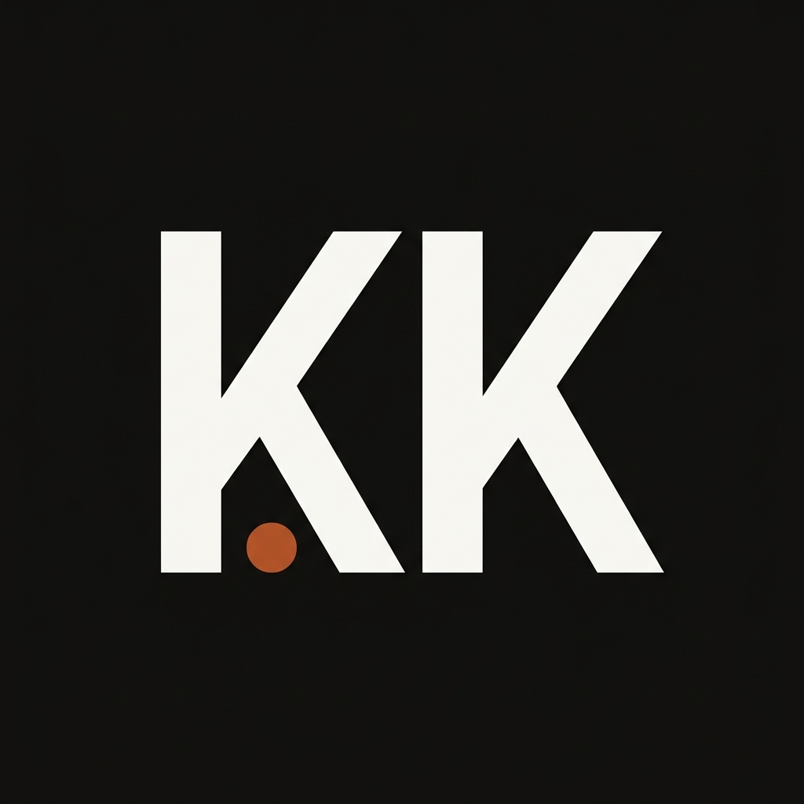

<div align="center">
  
  <h1>Kiran Kumbar — Full-Stack Engineer</h1>
  <p>
    <strong>A highly interactive, cinematic, and production-ready portfolio built with Next.js 14 and Framer Motion.</strong>
  </p>

  <p>
    <a href="https://portfolio-ak-phi.vercel.app/" target="_blank">
      
    </a>
  </p>
</div>

<br />

## ✨ Features

- **🚀 Next.js 14 App Router:** Built for extreme performance and seamless server/client rendering.
- **🎨 Cinematic Animations:** Orchestrated via `framer-motion`, featuring a custom cinematic preloader, smooth scrolling, and scroll-linked reveals.
- **📖 3D Interactive Book Experience:** A hyper-realistic, scroll-driven 3D book to showcase the resume. Includes true 3D physics, paper curl effects, dynamic lighting, and realistic shadows.
- **💅 Premium Aesthetic:** Curated "Champagne & Obsidian" color palette with subtle grain textures and glassmorphism UI elements.
- **📱 Fully Responsive:** Carefully crafted to ensure the complex 3D animations and layouts remain perfectly proportional across mobile, tablet, and desktop viewports.

<br />

## 🛠️ Tech Stack

- **Framework:** [Next.js](https://nextjs.org/) (React)
- **Styling:** [Tailwind CSS](https://tailwindcss.com/)
- **Animation:** [Framer Motion](https://www.framer.com/motion/)
- **Icons:** [React Icons](https://react-icons.github.io/react-icons/)
- **Deployment:** [Vercel](https://vercel.com/)

<br />

## 🚀 Getting Started

First, clone the repository and install the dependencies:

```bash
git clone https://github.com/Kiran-Kumbar/Portfolio-Ak.git
cd Portfolio-Ak
npm install
```

Then, run the development server:

```bash
npm run dev
```

Open [http://localhost:3000](http://localhost:3000) with your browser to see the result.

<br />

## 📐 Architecture Highlights

- **`Experience.tsx`**: Houses the custom 3D book animation engine. Utilizes `useTransform` and scroll progress to simulate true paper physics without requiring heavy WebGL libraries.
- **`ClientShell.tsx` & `Loader.tsx`**: A custom application shell that intercepts the initial load to present a beautifully orchestrated, glowing cinematic preloader.
- **`globals.css`**: Defines a strict, CSS variable-driven design token system to ensure colors (`--color-background`, `--color-accent`) remain perfectly consistent across all Tailwind classes.

<br />

<div align="center">
  <p>Designed and Developed by <b>Kiran Kumbar</b></p>
</div>
